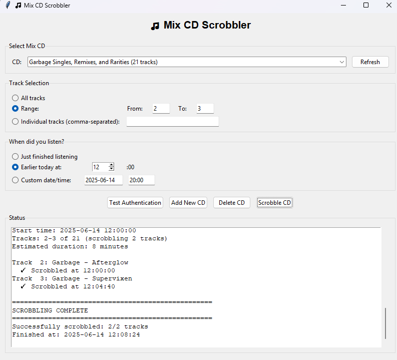

# 🎵 Mix CD Scrobbler

A Python application for scrobbling your vintage mix CD collections to Last.fm. Perfect for music lovers who want to track their listening history from physical media!

## Features

- **GUI Interface**: Easy-to-use desktop application built with Tkinter
- **Command Line Version**: Terminal-based interface for power users
- **Mix CD Database**: Store and manage multiple mix CD collections
- **Flexible Track Selection**: Scrobble all tracks, specific ranges, or individual songs
- **Smart Timing**: Backdate scrobbles to when you actually listened
- **Bulk Import**: Paste entire tracklists at once
- **Last.fm Integration**: Full authentication and scrobbling support

## Screenshots


*Main GUI interface showing CD selection and scrobbling options*

## Installation

### Prerequisites
- Python 3.6 or higher
- A Last.fm account
- Last.fm API credentials (free)

### Setup

1. **Clone the repository**
   ```bash
   git clone https://github.com/yourusername/mix-cd-scrobbler.git
   cd mix-cd-scrobbler
   ```

2. **Install dependencies**
   ```bash
   pip install -r requirements.txt
   ```

3. **Get Last.fm API credentials**
   - Go to https://www.last.fm/api/account/create
   - Sign in with your Last.fm account
   - Create an application:
     - **Name**: Mix CD Scrobbler
     - **Description**: Personal script for scrobbling mix CDs
     - **Callback URL**: http://localhost
   - Copy your API Key and Shared Secret

4. **Run the application**
   ```bash
   # GUI version (recommended)
   python mixcd_gui.py
   
   # Command line version
   python mixcd_scrobbler.py
   ```

5. **First-time setup**
   - The app will prompt you for your Last.fm API credentials
   - Follow the authentication flow to authorize the application
   - Your credentials will be saved for future use

## Usage

### Adding Mix CDs

**Format your tracklists like this:**
```
Artist - Track Title [Album Name]
The Replacements - I Will Dare [Let it Be]
Ben Folds Five - Brick [Whatever and Ever Amen]
```

**Tips:**
- Album name in brackets is optional
- The app automatically cleans up album names (removes "single", "EP", etc.)
- Use the bulk paste feature for faster entry

### Scrobbling Options

- **All tracks**: Scrobble the entire CD
- **Range**: Choose specific track numbers (e.g., tracks 5-12)
- **Individual**: Select specific tracks by number (e.g., 1,3,7,9)

### Timing Options

- **Just finished**: Calculates start time based on track count
- **Earlier today**: Specify what hour you listened
- **Custom**: Set exact date and time

## File Structure

```
mix-cd-scrobbler/
├── mixcd_scrobbler.py      # Core scrobbling functionality
├── mixcd_gui.py            # Desktop GUI application
├── mix_cds.json            # Your CD database (created automatically)
├── lastfm_credentials.json # Your API credentials (created on first run)
├── requirements.txt        # Python dependencies
└── README.md              # This file
```

## Getting Started

When you first run the application, it will create an empty database. You can start adding your own mix CDs right away using the "Add New CD" feature in either the GUI or command-line version.

## Troubleshooting

### Authentication Issues
- Make sure your Last.fm credentials are correct
- Check that you've authorized the application in your browser
- Try resetting credentials from the main menu

### Scrobble Failures
- Verify your internet connection
- Some tracks may be ignored if they're duplicates
- Check the status console for detailed error messages

### Track Format Issues
- Ensure tracks follow the "Artist - Title [Album]" format
- Use the preview feature when adding new CDs
- Album names are optional but recommended

## Contributing

Contributions are welcome! Please feel free to submit pull requests or open issues for bugs and feature requests.

### Development Setup
```bash
git clone https://github.com/yourusername/mix-cd-scrobbler.git
cd mix-cd-scrobbler
pip install -r requirements.txt
```

## License

This project is licensed under the MIT License - see the [LICENSE](LICENSE) file for details.

## Acknowledgments

- Last.fm for their excellent API
- The xennial generation for keeping mix CDs alive
- Everyone who still believes in the art of the mixtape

## Disclaimer

This tool is for personal use only. Please respect artists' rights and Last.fm's terms of service. Only scrobble music you've actually listened to!